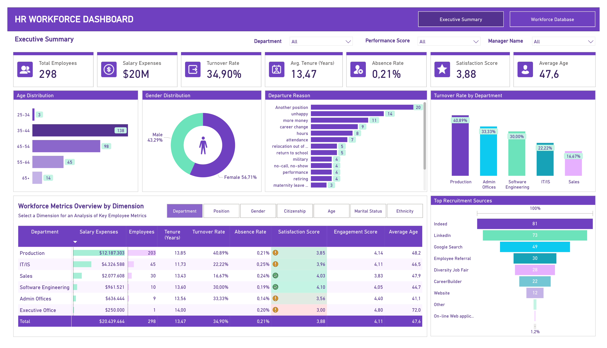
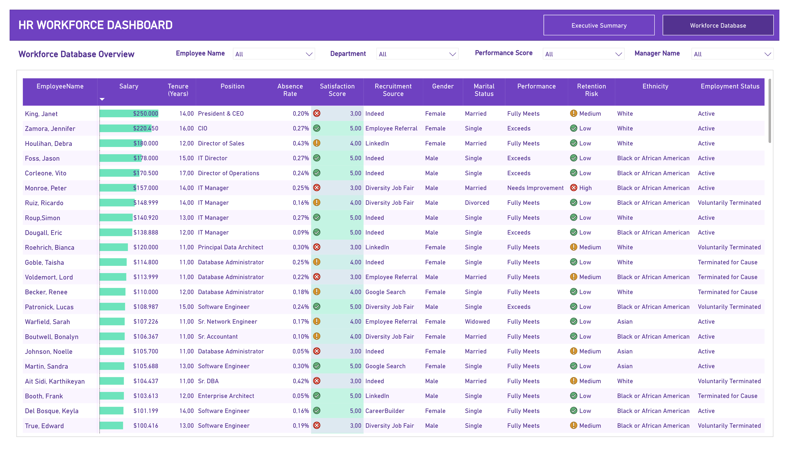

# 📊 HR Workforce Analytics Dashboard | Power BI



**Business question:** How can management use workforce data to understand employee turnover, workforce composition, recruitment effectiveness, and retention risk?

**Domain:** Human Resources / Workforce Analytics  
**Tools:** Power BI • DAX • Power Query • Data Visualization  
**Project Type:** Business Intelligence / HR Analytics

---

## 📑 Table of Contents

1. [📌 Background & Overview](#-background--overview)
2. [📂 Dataset Description & Data Structure](#-dataset-description--data-structure)
3. [🧠 Design Thinking Process](#-design-thinking-process)
4. [⚒️ Main Process](#️-main-process)
5. [📊 Key Insights & Visualizations](#-key-insights--visualizations)
6. [🔎 Final Conclusion & Recommendations](#-final-conclusion--recommendations)

---

## 📌 Background & Overview

### Objective

Employee turnover can create significant recruitment costs, productivity gaps, and knowledge loss. This project uses Power BI to turn employee-level HR data into a management dashboard that helps identify where workforce risks are concentrated.

The analysis answers practical business questions:

✔️ What is the overall workforce size and turnover rate?  
✔️ Which departments have the highest turnover?  
✔️ What are the main reasons employees leave?  
✔️ How are employees distributed by age and gender?  
✔️ Which recruitment sources contribute the most hires?  
✔️ Which employees show higher retention risk based on workforce attributes?

### 📖 What is this project about?

The dashboard connects workforce metrics with employee-level information to support HR decision-making.

The analysis focuses on:

- Workforce size and structure
- Turnover and retention risk
- Department-level performance
- Employee satisfaction and engagement
- Absence patterns
- Recruitment sources
- Departure reasons
- Employee demographics
- Employee-level workforce records

### 👤 Who is this project for?

✔️ HR Analysts & People Analysts  
✔️ HR / Talent Acquisition Managers  
✔️ Workforce Planning Teams  
✔️ Department Managers  
✔️ Business Decision-Makers

---

## 📂 Dataset Description & Data Structure

### 📌 Data Source

- **Dataset:** HR Workforce / Employee Database
- **Domain:** Human Resources / Workforce Analytics
- **Granularity:** Employee-level records
- **Dataset size:** 298 employees
- **Format:** Structured employee database
- **Main analytical areas:** Department, Position, Salary, Tenure, Turnover, Absence, Satisfaction, Engagement, Recruitment Source, Performance, Retention Risk, Demographics and Employment Status

### 📊 Data Structure & Relationships

The project uses an employee-level workforce dataset. The same employee-level data supports both the management summary and detailed workforce database views.

### 1️⃣ Workforce Metrics & Analytical Fields

| Field / Dimension | Business Use |
|---|---|
| Employee Name | Employee-level identification |
| Department | Compare workforce and turnover by department |
| Position | Analyze workforce structure and roles |
| Salary | Evaluate salary expenses |
| Tenure | Understand employee experience and retention |
| Turnover Rate | Monitor employee turnover |
| Absence Rate | Monitor workforce attendance |
| Satisfaction Score | Evaluate employee satisfaction |
| Engagement Score | Evaluate workforce engagement |
| Recruitment Source | Compare hiring channels |
| Performance | Assess employee performance |
| Retention Risk | Identify employees requiring attention |
| Employment Status | Distinguish active and terminated employees |
| Age / Gender | Analyze workforce composition |

<details>
<summary>Click to expand – Key analytical metrics</summary>

- Total Employees: **298**
- Salary Expenses: **$20M**
- Average Tenure: **13.47 years**
- Turnover Rate: **34.90%**
- Absence Rate: **0.21%**
- Satisfaction Score: **3.88**
- Average Age: **47.6 years**
- Average Engagement Score: **4.11**

</details>

### 🥰 Data Relationships

The Power BI model is centered on employee-level workforce data and supports interactive filtering by:

**Department → Position → Employee → Workforce Metrics**

Additional dimensions include performance, manager, recruitment source, gender, marital status, ethnicity and employment status.

---

## 🧠 Design Thinking Process

The dashboard was designed from an HR management perspective rather than simply displaying employee statistics.

### 1️⃣ Empathize

Understand the business impact of employee turnover, recruitment costs, absenteeism and retention risk.

### 2️⃣ Define

Translate the HR problem into analytical questions:

- Where is employee turnover highest?
- Which departments require attention?
- Why are employees leaving?
- Which recruitment sources are most effective?
- What workforce characteristics are associated with higher retention risk?

### 3️⃣ Ideate

Select KPIs and visuals that allow HR stakeholders to quickly compare:

- Departments
- Age groups
- Gender
- Departure reasons
- Recruitment sources
- Employee performance
- Retention risk

### 4️⃣ Prototype & Review

Build an interactive Power BI dashboard with filters and two complementary views:

**Executive Summary → Workforce Database**

---

## ⚒️ Main Process

### 1️⃣ Data Cleaning & Preparation

Power Query was used to prepare employee-level data for reporting, including:

- Data type validation
- Field standardization
- Employee-level data preparation
- KPI preparation
- Categorization of workforce attributes

### 2️⃣ Exploratory Data Analysis

The analysis explored relationships between:

- Turnover and department
- Turnover and employee demographics
- Departure reasons
- Recruitment sources
- Satisfaction and engagement
- Performance and retention risk
- Salary and workforce structure

### 3️⃣ KPI & DAX Development

Key measures were created to monitor:

- Total Employees
- Salary Expenses
- Turnover Rate
- Average Tenure
- Absence Rate
- Satisfaction Score
- Average Age
- Engagement Score
- Department-level turnover

### 4️⃣ Power BI Visualization

The final report contains **2 dashboard pages**:

1. Executive Summary
2. Workforce Database

---

## 📊 Key Insights & Visualizations

### 🔍 Dashboard 1 — Executive Summary


### 📌 Key Findings

- The workforce contains **298 employees** with total salary expenses of approximately **$20M**.
- Overall turnover rate is **34.90%**, indicating a significant employee-retention challenge.
- **Production** has the highest department turnover rate at **40.89%** and represents the largest workforce with **203 employees**.
- Software Engineering has a **30.00%** turnover rate, while Admin Offices records **33.33%**.
- The most common displayed departure reason is **leaving for another position**, followed by being **unhappy** and seeking **more money**.
- **Indeed** and **LinkedIn** are the largest recruitment sources, with 81 and 73 employees respectively.
- The workforce has an average satisfaction score of **3.88** and average engagement score of approximately **4.11**.
- Employees aged **35–44** form the largest age group with **138 employees**.

### 💡 Business Implication

HR should prioritize retention initiatives in high-turnover departments, especially Production, while investigating the reasons behind voluntary departures such as external job opportunities, dissatisfaction and compensation.

---

### 🔍 Dashboard 2 — Workforce Database



### 📌 Key Findings

The detailed database provides employee-level visibility across:

- Salary
- Tenure
- Position
- Absence rate
- Satisfaction score
- Recruitment source
- Gender
- Marital status
- Performance
- Retention risk
- Ethnicity
- Employment status

This view allows HR managers to move from high-level workforce trends to individual employee records and identify employees who may require further review.

### 💡 Business Implication

A detailed workforce database can support targeted HR actions by allowing managers to investigate individual employees and combine retention risk with performance, tenure, satisfaction and employment status.

---

## 🔎 Final Conclusion & Recommendations

The analysis shows that the organization has a relatively experienced workforce, but employee turnover remains a major workforce-management issue.

### 📌 Key Takeaways

✔️ **Prioritize high-turnover departments:** Production should receive immediate attention because of its high turnover rate and large employee population.

✔️ **Address the main reasons for departure:** Investigate external job opportunities, employee dissatisfaction and compensation as key areas for retention initiatives.

✔️ **Strengthen retention monitoring:** Combine satisfaction, engagement, tenure, performance and retention-risk indicators to identify employees who may require proactive support.

✔️ **Evaluate recruitment channels:** Continue leveraging high-volume sources such as Indeed and LinkedIn while assessing hiring quality and long-term retention by source.

✔️ **Use employee-level data for action:** Move beyond aggregate HR metrics and use the Workforce Database to support targeted follow-up and workforce planning.

---

## 🛠️ Tools & Technologies

| Tool | Purpose |
|---|---|
| **Power BI** | Interactive dashboard and HR reporting |
| **DAX** | KPI and turnover calculations |
| **Power Query** | Data preparation and transformation |
| **Excel / Source Data** | Employee-level source data |
| **Git / GitHub** | Portfolio and version control |

---

## 📁 Repository Contents

```text
hr-workforce-analytics/
│
├── README.md
├── hr-workforce-analytics.pbix
├── hr-workforce-analytics.pdf
└── dashboard_images/
    ├── 01_executive_summary.png
    └── 02_workforce_database.png
```

---

## 📌 Portfolio Note

This project demonstrates how Power BI can be used to transform employee-level HR data into a practical workforce intelligence solution.

The dashboard combines **workforce KPIs, turnover analysis, recruitment insights, employee demographics and retention-risk information** to support data-driven HR decision-making.
